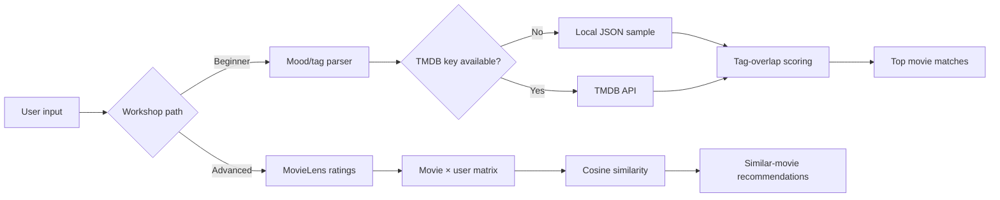

<div align="center">

# Movie Recommender Workshop

**Python fundamentals · API integration · recommendation logic · collaborative filtering**

A beginner-friendly workshop project that starts with transparent rule-based recommendations, adds optional live TMDB data, and then extends into item-item collaborative filtering with MovieLens ratings.

</div>

---

## Project purpose

I built this project as a hands-on Python workshop where students can see recommendation systems grow in complexity without needing to understand machine learning before they can participate.

The project intentionally has three learning layers:

| Level | What students build | Main concepts |
| --- | --- | --- |
| **1. Local recommender** | Match user mood words against a small local movie dataset | Python functions, dictionaries, sets, JSON, scoring logic |
| **2. Live-data extension** | Pull fresh movie results from TMDB and map moods to genres | REST APIs, environment variables, HTTP errors, fallback design |
| **3. Collaborative filtering** | Recommend movies from MovieLens user-rating patterns | User-item matrices, cosine similarity, item-item recommendation |

> **Accuracy note:** the beginner recommender is deterministic tag matching, not a trained AI model. The advanced script demonstrates memory-based collaborative filtering using rating similarity.

---

## How it works



The local path is intentionally resilient: students can complete the core workshop with no external account, API key, or internet dependency. Live TMDB access is an extension, not a requirement.

---

## What this project demonstrates

- Python input handling, functions, dictionaries, lists, sets, and file I/O
- JSON parsing and local fallback data
- REST API requests with `requests`
- secret management through environment variables
- graceful handling of missing keys, network failures, and malformed data
- fuzzy title matching with the Python standard library
- item-item collaborative filtering from MovieLens ratings
- cosine similarity with both pandas/scikit-learn and a pure-Python fallback
- workshop-oriented documentation and progressive technical instruction

---

## Quick start — beginner workshop

### 1. Create a virtual environment

```bash
python -m venv .venv
```

Activate it:

```bash
# Windows PowerShell
.\.venv\Scripts\Activate.ps1

# macOS / Linux
source .venv/bin/activate
```

### 2. Install dependencies

```bash
pip install -r requirements.txt
```

### 3. Run the local recommender

```bash
python recommender.py
```

Try inputs such as:

```text
chill, funny
action, adventure
cozy, feel-good
```

No API key is required for this path.

---

## Optional live TMDB extension

The beginner script can also pull live movie data from **The Movie Database (TMDB)**.

Run the setup helper:

```bash
python setup_api_key.py
```

The helper stores the key in a local `.env` file. Key entry is hidden in the terminal, and `.env` is ignored by Git.

You can also configure it manually:

```bash
cp .env.example .env
```

Then replace the placeholder locally:

```text
TMDB_API_KEY=your_key_here
```

If the key is missing or TMDB is unavailable, the program falls back to `data/movies.json` automatically.

---

## Advanced path — collaborative filtering

`advanced_recommender.py` uses the **MovieLens Latest Small** ratings dataset to build an item-item recommender.

Conceptually:

1. Load movie titles and user ratings.
2. Keep movies with enough rating history.
3. Represent each movie as a vector of user ratings.
4. compare movie vectors using cosine similarity.
5. Return the most similar titles to the movie entered by the user.

### Dataset setup

Download **MovieLens Latest Small** from GroupLens and unzip it so these files exist locally:

```text
data/
└── ml-latest-small/
    ├── movies.csv
    └── ratings.csv
```

`tags.csv` is optional for the current implementation.

The downloaded dataset is intentionally not stored in this repository. See [`data/README.md`](data/README.md) for the source, citation, and usage notes.

### Install advanced dependencies

```bash
pip install -r requirements-advanced.txt
```

### Run

```bash
python advanced_recommender.py
```

The script prefers pandas + scikit-learn when available and includes a pure-Python collaborative-filtering fallback for environments where those packages cannot be used.

---

## Repository structure

```text
movie-recs-workshop/
├── .github/
│   └── workflows/
│       └── ci.yml
├── data/
│   ├── README.md
│   └── movies.json
├── tests/
│   ├── test_advanced_recommender.py
│   └── test_recommender.py
├── .env.example
├── .gitignore
├── README.md
├── START_HERE.md
├── PROJECT_STRUCTURE.md
├── recommender.py
├── advanced_recommender.py
├── setup_api_key.py
├── requirements.txt
└── requirements-advanced.txt
```

---

## Security and reliability choices

- Real API keys are never committed to the repository.
- `.env` and other local secret/config files are ignored by Git.
- The API setup helper hides key entry instead of echoing it to the terminal.
- The beginner workshop does not require an API key.
- TMDB request failures fall back to local data instead of stopping the lesson.
- Downloaded MovieLens files stay local rather than being mixed into the source tree.
- CI validates syntax and core recommendation behavior without calling external APIs.

---

## Testing

Run the built-in tests with:

```bash
python -m unittest discover -s tests -v
```

The tests cover the core deterministic logic, including:

- input tag normalization
- mood-to-genre mapping
- local recommendation scoring and ranking
- sparse cosine similarity
- fuzzy movie-title matching
- pure-Python advanced recommendation output

GitHub Actions runs the same test suite on pushes and pull requests.

---

## Data notes

### Local workshop data

`data/movies.json` is a small teaching dataset used only to keep the beginner exercise runnable offline. It is not intended to represent current streaming availability or a production catalog.

### MovieLens

The advanced exercise uses **MovieLens Latest Small** from GroupLens Research at the University of Minnesota. Their dataset documentation includes redistribution, attribution, and commercial-use conditions, so this repository keeps the dataset download step separate from the source code.

Recommended citation from the MovieLens documentation:

> F. Maxwell Harper and Joseph A. Konstan. *The MovieLens Datasets: History and Context.* ACM Transactions on Interactive Intelligent Systems, 2015.

---

## Scope

This is an educational command-line project, not a production recommendation service. It is designed to make the progression from basic Python logic to external APIs and collaborative filtering easy to inspect and explain.

Potential future extensions include offline evaluation on held-out ratings, cached TMDB responses, a small web interface, and additional recommendation strategies.

---

## Portfolio context

This project highlights both **technical implementation** and **technical communication**: building a working Python recommender while structuring the experience so beginners can learn from it in stages.

Maintained by **Deja Ware**.
